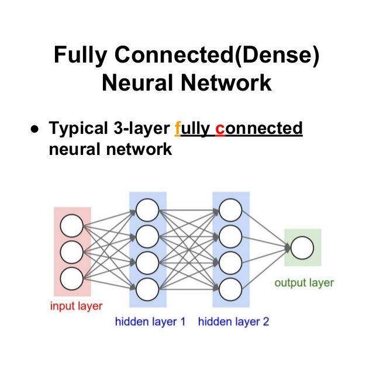

# Categroy 1 - Basic 모델

## Dense Layer (1)

Dense Layer (FC: Fully Connected Layer 전체가 연결되어 있다. )

Newron = Node

layer 안에 있는 각각의 뉴런들은 가중치(weight)를 가지고 있으며 학습이 진행 됨에 따라 weight 가 변한다.

Input Layer에는 반드시 지정해야 되는 input_shape 가 있다.

왼쪽에서 부터 오른쪽으로 데이터가 이동 (순방향)

첫번 째 layer는 어떤식으로 입력값이 들어오는 지 모르기 때문에 input_shape 가 **필수**

input_shape : data가 어떤 모양으로 들어오는지

hidden layer 영역은 black box 영역이다.

```
Dense Layer.
Dense Layer 는 딥러닝에서 가장 기본이 되는 Layer 입니다.

Neuron (Node) 내부는 W (weight) * X (입력값) 으로 이루어져 있다고 생각하시면 됩니다. (층마다 + bias도 붙습니다.)

Dense Layer는 Fully Connected Layer라고도 불리웁니다.

논문에서는 Fully Connected Layer 혹은 FC로 줄여서 많이 불리우니 이 점 꼭 참고해 주세요.
```

