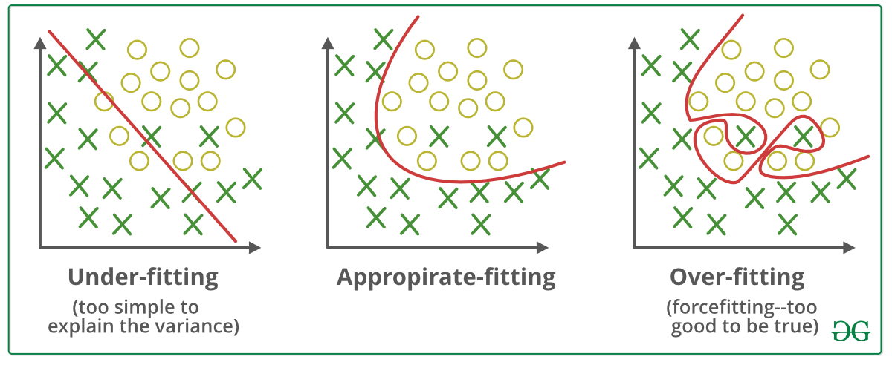
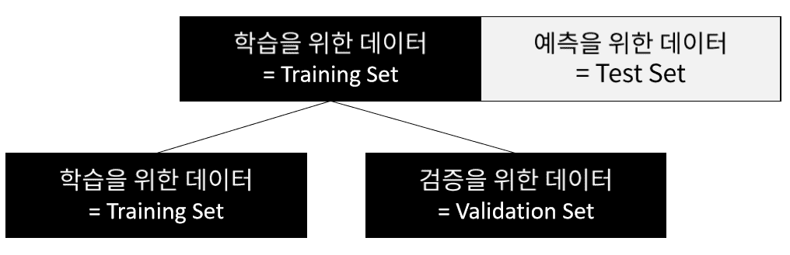
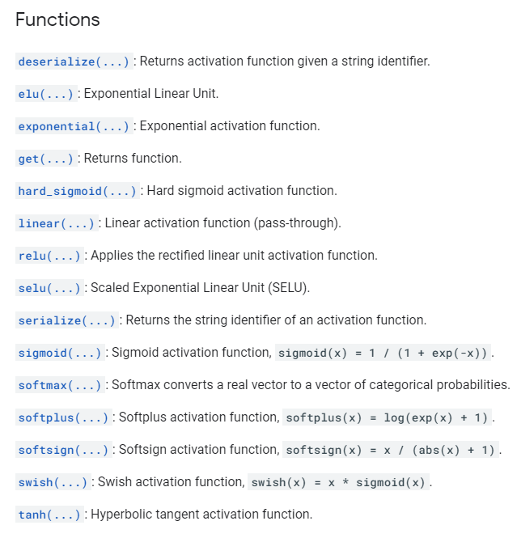
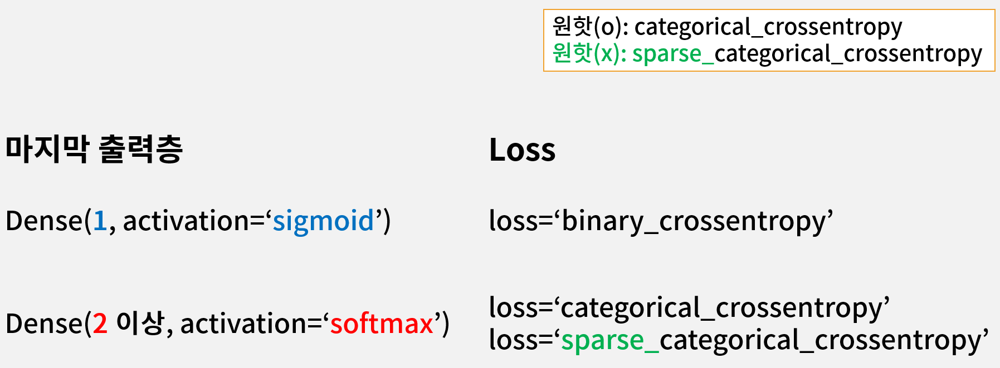

# Categroy 2 - 심층신경만 모델(이미지)




x-train 과 y-train 으로 학습


Over-fitting : sample 이 모델에 과하게 적합

Under-fitting : 

Appropriate-fitting 을 찾는 것이 목표

data 가 6만개 정도 있다면 4만개는 Train set 2만개는 validations set 로 나누어 두개의 acc, loss 그래프를 그린다 이 때 validations graph 로 appropirate-fitting 한 epoch 점을 찾아야 한다.

Train





**ModelCheckpoint** : appropirate-fitting 지점을 자동으로 찾아 준다.

학습 중 validation의 loss 를 보고 낮은 값 갱신 시 모델 weight 값을 저장해 둔다. (갱신시 마다 덮어 씌운다.) (loss, acc, validation_acc 로도 기준을 잡을 수 있다. 일반적으로 validation_loss로 잡느다.)

```python
# modelcheckpoint 사용하기 위해
checkpoint_path = "my_checkpoint.ckpt"							# or "my_checkpoint.h5" 로도 가능
checkpoint = ModelCheckpoint(filepath=checkpoint_path,			# 저장 파일 경로
                            save_weights_only=True,				# 모델 전체를 저장하지 않고 가중치만 저장
                            save_best_only=True,				# 모든 에폭을 저장하지 않고 베스트만 저장
                            monitor='val_loss',					# 기준 값을 선언
                            verbose=1)							# log 출력을 할지 말지 0 or 1 (출력)
```

```python
# 학습 진행
history = model.fit(x_train, y_train,							# 학습 data
                   validation_data=(x_valid, y_valid),			# 검증 data, 튜플 형식이여야 한다.
                   epochs=20,									# epoch
                   callbacks=[checkpoint],						# callbacks 여러가지가 들어갈 수 있어 s 가 붙고 리스트로
                   )
```

```python
# 학습 진행 후 결과 모델에 로드해 준다. (자격증 시험에서는 가장 마지막에 오는 코드이기도 하다.)
model.load_weights(checkpoint_path)							# 저장 된 값을 모델에 로드해 줘야 적용된다!!!
```


## 이미지 데이터 전처리 - 정규화

**Image의 픽셀 값은 0 ~ 255 (8bit) 범위를 가집니다.**

**이를 0 ~ 1 사이의 값을 가지도록 정규화 (Normalization) 합니다.**

이미지 rescale rgb(각각 8bit 로 구성 0 ~ 255)

이미지 모든 픽셀 값을 0~1 값을 가지도록 한다 = Normalization (정규화, 스케일을 바꾼다.)

정규화 하는 이유는 데이터를 빠르게 수렴하게 하기 위해서 이다. (이때 acc 증가한다. 분산값을 줄여 학습 속도를 빠르게 한다.)

분산과 학습속도는 밀접한 상관관계가 있다.

이미지는 255라는 범위가 정해져 있어 정규화가 이점이 되지만

다른 데이터 집값을 예로들면 강남의 집값이라 던지 특별하게 큰값이 있을 경우 정규화를 안해야 할 때도 있다.

## 원핫인코딩 (One Hot Encoding)

하나의 요소만을 나타내는 독립적인 방법

예 ) 봄 여름 가을 겨울을 파이썬으로 나타내기 위해선 숫자로 각 0, 1, 2, 3 에 대응하게 만들 수 있다 하지만 0 + 1 = 여름, 1 + 2 = 겨울 이렇게 상관관계가 이루어질 수 있기 때문에 이를 독립적으로 만들기 위해

| 봄   | 여름 | 가을 | 겨울 |
| ---- | ---- | ---- | ---- |
| 1    | 0    | 0    | 0    |
| 0    | 1    | 0    | 0    |
| 0    | 0    | 1    | 0    |
| 0    | 0    | 0    | 1    |

이런 식으로 나타낸다.  label 값에 대해 독립적으로 만들어 준다.

[1, 0 ,0 ,0]

[0, 1 ,0 ,0]

[0, 0 ,1 ,0] 

[0, 0 ,0 ,1]


## 활성함수 (Activation Function)

선형함수의 집합 (Dense) 으로 층층이 구성 되어 있다

이때 층이 겹겹이 쌓이면서 선형 x 선형 = 선형함수 로 나타내지게 되는데 이는 선형함수의 단층과 별반 다를게 없다.

여러층으로 구성되어 있는 이점을 살리기 위해(복잡한 문제를 풀 수 있게) 선형 함수 사이에 비선형 함수를 넣어 선형 x 비선형 x 선형 관계를 만든다.

이때, 비선형 함수를 활성함수 (activation function) 이라 한다.

```python
mode = tf.kertas.models.Sequential([
    tf.keras.layers.Flatten(input_shape=(28,28)),
    tf.keras.layers.Dense(512, activation='relu'),
    ...
    tf.keras.layers.Dense(10, activation='softmax'),
])

# 중간층 relu, 출력층 sigmoid or softmax 로 사용 (시험)
```


relu, sigmoid, softmax등이 있다

그 밖의 활성함수




## 분류 - 출력층 활성함수와 Loss 설정

```python
model = Sequential([

    ...
    Dense(2, activation='softmax'),
])

model.compile(optimizer='adam',
              loss='sparse_categorical_crossentropy', # or 'categorical_crossentropy', y의 label이 원핫인코딩이 되어있는지에 따라 결정
              metrics=['accuracy'])
```

```python
model = Sequential([

    ...
    tf.keras.layers.Dense(1, activation='sigmoid'),
])

model.compile(optimizer='adam',
              loss='binary_crossentropy',
              metrics=['accuracy'])
```

activation 함수 softmax, sigmoid 에 따라 컴파일 loss 구문이 다르다. 외워야 한다!

분류 : 이진 분류 case, 다중 분류 case

이진 : 2개 class

다중 : 3개 class





**sigmoid function** : x에 어떤 값이 들어가던 0~1 사이 값이다. (확률값)

Dense node 가 1이고 

class A 경우 (0.4 < 0..5 : 0.4가 0.5보다 작다 => class A), 

class B 경우 (0.6<0.5 : 0.6가 0.5 보다 크다 => class B)

두가지 경우로 나뉜다. ==> Binary


softmax function : 

Dense node 가 2 이상

A 노드애 확률은 0.4 이고 B노드에 확률이 0.6 일때, B 노드에 확률이 더 크므로 이는 B class 가 된다. 이를 softmax function 방식이다.

즉, 여러개의 노드 중 가장 높은 갚의 확률은 가진 노드의 class로 정의 된다.

각 노드마다 확률을 가지고 있는데 다 더하면 1이 된다. 


**Flatten이란?**

- 고차원을 1D로 변환하여 **Dense Layer에 전달**해 주기 위하여 사용합니다.
- 28 X 28 의 **2D**로 되어 있는 이미지를 784로 **1D로 펼쳐 주는 작업**입니다.

