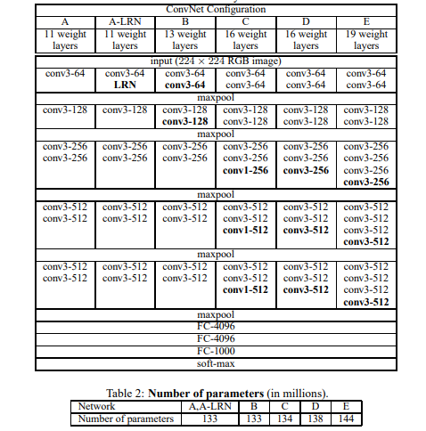

# Category 3 - 이미지 분류 모델 (CNN) - Type B

TFDS = TesorFlow DataSets

VGG Net 논문 (2014년 이미지 분류 대회 2위)

VGG16 (16Weight 16개 Layer)

VGG19 (19Weight 19개 Layer)

두 모델이 많이 쓰임 16이랑 19 비교시 19가 조금 성능이 더 좋은 정도라 연산량이 천만개 정도 적은 16 레이어를 실무에서 가장 많으 쓴다.

16~19 가 가장 최적화

1. 레이어가 더 깊을 수록 성능이 좋은건 아니다.

2. 3X3 필터는 깊은 레이어의 최적화 되어 있다.

논문은 위 두가지를 시사하는 바이다.

VGG Net 을 가져와 쓰는거랑 직접 구현하는 거랑 성능 차이가 크다.

그 이유는 가져와 쓰는 VGG Net은 이미 학습이 충분히 되어 있는 상태이기 때문이다.

그렇기에 VGG Net의 구조 뿐만 아니라 가중치까지 같이 가져와 쓰는것이 성능이 더 좋다.